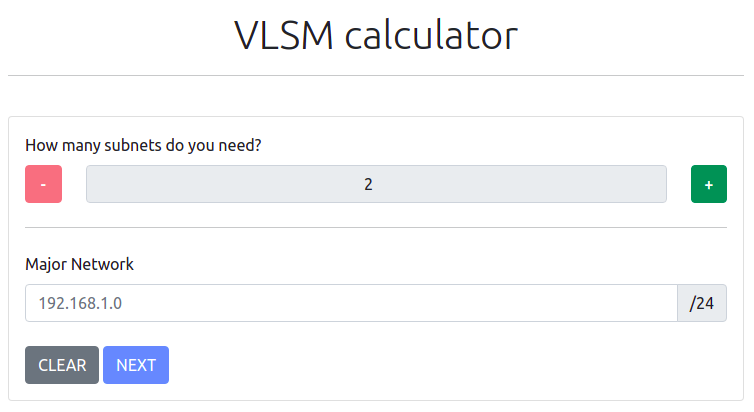

# Variable Length Subnet Mask Calculator

### The site is published to GitHub Pages. It's available [here](https://0l1v3rr.github.io/vlsm-calculator/).



## Building from source
```sh
git clone https://github.com/0l1v3rr/vlsm-calculator.git
cd vlsm-calculator
npm i
npm run dev
```